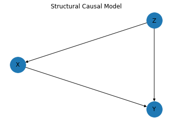

| OS        |  Status |
| :-------------: |:-------------:|
| Linux       |     |
| Windows |  |
| Mac |  |

A Python package implementing Structural Causal Models (SCM).

The library uses the CAS library [SymPy](https://github.com/sympy/sympy) to allow the user to state arbitrary assignment functions and noise distributions as supported by SymPy and builds the DAG with [networkx](https://github.com/networkx/networkx).

It supports the features:
  - Sampling
  - Intervening
  - Plotting
  - Printing

 and by extension all methods on a DAG provided by networkx after accessing the member variable dag

# Installation
Git clone the repository and run the setup.py file
```
git clone https://github.com/maichmueller/scm
cd scm
python setup.py install
```

# Example usage

To build the DAG


with the assignments

)

])

])

one can describe the assignments as strings


```python
from scm import SCM

myscm = SCM(
    [
        "Z = N, N ~ LogLogistic(alpha=1, beta=1)",
        "X = N * 3 * Z ** 2, N ~ LogNormal(mean=1, std=1)",
        "Y = N + 2 * Z + sqrt(X), N ~ Normal(mean=2, std=1)"
    ]
)
```

or build the assignments piecewise themselves via an assignment map


```python
from sympy.stats import LogLogistic, LogNormal, Normal


assignment_map = {
   "Z": (
       "N",
       LogLogistic("N", alpha=1, beta=1)
   ),
   "X": (
       "N * 3 * Z ** 2",
       LogNormal("N", mean=1, std=1),
   ),
   "Y": (
       "N + 2 * Z + sqrt(X)",
       Normal("N", mean=2, std=1),
   ),
}

myscm = SCM(assignment_map)
```

The SCM supports a form of pretty printing its current setup, which includes mentioning active interventions
and the assignments


```python
print(myscm)
```

    Structural Causal Model of 3 variables: Z, X, Y
    Following variables are actively intervened on: []
    Current Assignments are:
    Z := f(N) = N	 [ N ~ LogLogistic(alpha=1, beta=1) ]
    X := f(N, Z) = N * 3 * Z ** 2	 [ N ~ LogNormal(mean=1, std=1) ]
    Y := f(N, X, Z) = N + 2 * Z + sqrt(X)	 [ N ~ Normal(mean=2, std=1) ]


One can easily perform interventions on the variables, e.g. a Do-intervention )


```python
myscm.do_intervention(["X"], [1])
```

and sample as many samples from it as desired


```python
myscm.sample(5)
```
<div>

<table border="1" class="dataframe">
  <thead>
    <tr style="text-align: right;">
      <th></th>
      <th>X</th>
      <th>Z</th>
      <th>Y</th>
    </tr>
  </thead>
  <tbody>
    <tr>
      <th>0</th>
      <td>1</td>
      <td>0.204204</td>
      <td>2.412121</td>
    </tr>
    <tr>
      <th>1</th>
      <td>1</td>
      <td>0.038627</td>
      <td>2.035116</td>
    </tr>
    <tr>
      <th>2</th>
      <td>1</td>
      <td>0.627638</td>
      <td>4.767240</td>
    </tr>
    <tr>
      <th>3</th>
      <td>1</td>
      <td>0.620331</td>
      <td>4.497902</td>
    </tr>
    <tr>
      <th>4</th>
      <td>1</td>
      <td>0.143817</td>
      <td>4.723647</td>
    </tr>
  </tbody>
</table>
</div>


The current intervention is also noted in its string representation


```python
print(myscm)
```

    Structural Causal Model of 3 variables: Z, X, Y
    Following variables are actively intervened on: ['X']
    Current Assignments are:
    Z := f(N) = N	 [ N ~ LogLogistic(alpha=1, beta=1) ]
    X := f(N) = 1	 [ N ~ LogNormal(mean=1, std=1) ]
    Y := f(N, X, Z) = N + 2 * Z + sqrt(X)	 [ N ~ Normal(mean=2, std=1) ]


which can be restored to the initial status via undoing the intervention


```python
myscm.undo_intervention()
```

If you have graphviz installed, you can also use it to plot the DAG easily

```python
myscm.plot(node_size=1000, alpha=1)
```


